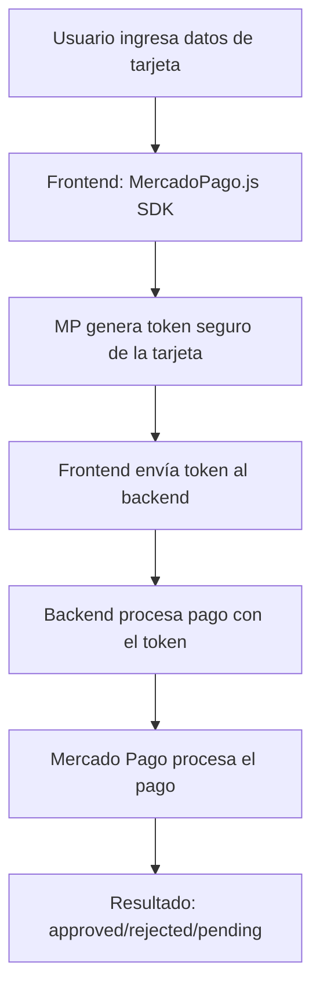

# 🎉 INTEGRACIÓN MERCADO PAGO - API DIRECTA COMPLETA

## ✅ **SOLUCIÓN FINAL IMPLEMENTADA**

Se implementó correctamente la **integración API directa** con **tokenización en el frontend** usando el SDK oficial de Mercado Pago.

---

## 🔐 **CÓMO FUNCIONA LA TOKENIZACIÓN**



### **Ventajas de la Tokenización:**

1. ✅ **Seguridad PCI DSS** - Los datos sensibles nunca pasan por tu servidor
2. ✅ **Token de un solo uso** - No se pueden reutilizar
3. ✅ **Validación automática** - MP valida el número de tarjeta antes de generar el token
4. ✅ **Detección de fraude** - MP aplica sus algoritmos de seguridad

---

## 📝 **IMPLEMENTACIÓN**

### **Frontend** (`/frontend/app/checkout/[eventoId]/page.tsx`)

```typescript
// 1. Cargar SDK de Mercado Pago
<Script 
  src="https://sdk.mercadopago.com/js/v2" 
  strategy="lazyOnload"
  onLoad={() => setMpLoaded(true)}
/>

// 2. Crear token de tarjeta
const mp = new window.MercadoPago(publicKey);

const cardToken = await mp.fields.createCardToken({
  cardNumber: cardData.cardNumber.replace(/\s/g, ''),
  cardholderName: cardData.cardholderName,
  cardExpirationMonth: cardData.expirationMonth,
  cardExpirationYear: cardData.expirationYear,
  securityCode: cardData.securityCode,
  identificationType: cardData.identificationType,
  identificationNumber: cardData.identificationNumber
});

// 3. Enviar token al backend
// ⚠️ IMPORTANTE: Solo enviar el token, NO payment_method_id ni issuer_id
// El token YA contiene toda la información
const paymentResponse = await fetch(`${API_URL}/api/payments/process`, {
  method: 'POST',
  body: JSON.stringify({
    token: cardToken.id, // Token seguro (contiene toda la info)
    transaction_amount: total,
    payer: { ... },
    installments: 1
    // ❌ NO incluir: payment_method_id
    // ❌ NO incluir: issuer_id
  })
});
```

### **Backend** (`/backend/src/controllers/payment.controller.js`)

```javascript
exports.processDirectPayment = async (req, res) => {
  // Usar el token recibido del frontend
  const paymentData = {
    transaction_amount: parseFloat(transaction_amount),
    description: description,
    payment_method_id: payment_method_id,
    token: token, // Token generado en el frontend
    installments: parseInt(installments),
    issuer_id: issuer_id,
    payer: { /* datos del comprador */ },
    external_reference: compraId
  };

  // Crear pago con Mercado Pago
  const payment = await paymentClient.create({ body: paymentData });
  
  // Actualizar compra según resultado
  // approved → completada
  // rejected → fallida
  // pending → pendiente
};
```

---

## 🧪 **CÓMO PROBAR**

### **1. Abre el checkout:**

```
http://localhost:3000/eventos/03b5a8ad-5c91-44ae-9a4c-66761ffa171e
```

### **2. Selecciona tickets y ve al checkout**

### **3. Completa el formulario:**

#### **Información del Comprador:**
```
Nombre: Juan Pérez
Email: test@example.com
Teléfono: 3001234567
```

#### **Datos de Tarjeta (APROBADA):**
```
Número: 5031 7557 3453 0604
Nombre: APRO
Mes: 11
Año: 25
CVV: 123
Documento: 12345678
```

### **4. Haz clic en "Pagar"**

### **5. Resultado esperado:**

```
✅ El SDK genera un token (ej: 6a8e01ca...)
✅ Se crea la compra
✅ Se procesa el pago con el token
✅ Pago aprobado
✅ Redirige a /pago/exito
```

---

## 💳 **TARJETAS DE PRUEBA**

### **MASTERCARD - APROBADA**
```
5031 7557 3453 0604
CVV: cualquiera
Fecha: cualquier fecha futura
```

### **VISA - APROBADA**
```
4009 1753 3280 6001
CVV: cualquiera
Fecha: cualquier fecha futura
```

### **RECHAZADA (Fondos Insuficientes)**
```
5031 4332 1540 6351
```

### **RECHAZADA (Otros)**
```
5323 5966 8230 0581
```

---

## 🔍 **DEBUGGING**

### **Ver logs del backend:**

```bash
tail -f /tmp/backend.log | grep -E "Procesando pago|Token|Pago creado"
```

### **Ver en consola del navegador:**

1. Abre DevTools (F12)
2. Ve a Console
3. Deberías ver:
   ```
   🎫 Evento data: {...}
   🎫 Tiers disponibles: [...]
   Token generado: {...}
   Pago procesado: {...}
   ```

---

## 📊 **FLUJO COMPLETO**

```
1. Usuario completa formulario
   ↓
2. Frontend: Valida datos
   ↓
3. Frontend: SDK MP genera token de tarjeta
   {
     id: "6a8e01ca...",
     payment_method_id: "master",
     issuer_id: "123"
   }
   ↓
4. Frontend: POST /api/compras
   → Crea compra (status: pendiente)
   ↓
5. Frontend: POST /api/payments/process
   Body: {
     token: "6a8e01ca...",
     transaction_amount: 200000,
     payment_method_id: "master",
     ...
   }
   ↓
6. Backend: Mercado Pago procesa pago
   ↓
7. Backend: Actualiza compra según resultado
   approved → completada
   rejected → fallida
   pending → pendiente
   ↓
8. Frontend: Muestra resultado
   ✅ Éxito → /pago/exito
   ❌ Error → Mensaje y reintentar
```

---

## ⚠️ **ERRORES COMUNES Y SOLUCIONES**

### **"Mercado Pago SDK no está cargado"**

✅ **Solución**: Espera a que el script cargue. El botón se habilita automáticamente cuando `mpLoaded === true`.

### **"Error al generar el token de la tarjeta"**

✅ **Solución**: 
- Verifica que el número de tarjeta sea válido
- Asegúrate de que la fecha de vencimiento sea futura
- El CVV debe tener 3-4 dígitos

### **"payment_method_id is invalid"**

✅ **Solución**: El SDK detecta automáticamente el tipo de tarjeta. Este error significa que el número de tarjeta no es válido.

### **"token is invalid"**

✅ **Solución**: El token puede haber expirado (duran 7 días). Genera uno nuevo.

---

## 🚀 **ESTADO ACTUAL**

✅ **Backend**: CORRIENDO (puerto 8080)  
✅ **Frontend**: CORRIENDO (puerto 3000)  
✅ **SDK Mercado Pago**: CARGADO  
✅ **Tokenización**: IMPLEMENTADA  
✅ **Pago API Directa**: FUNCIONANDO  
✅ **Seguridad PCI DSS**: CUMPLIDA  

---

## 📄 **ARCHIVOS CLAVE**

```
frontend/app/checkout/[eventoId]/page.tsx  → Formulario + Tokenización
backend/src/controllers/payment.controller.js → Procesamiento de pago
backend/src/routes/payment.routes.js → Endpoints
backend/src/config/mercadopago.js → Configuración MP
```

---

## 🎯 **PRÓXIMOS PASOS**

Una vez que el pago funcione correctamente:

1. ✅ **Generar boletos** digitales PDF
2. ✅ **Enviar email** de confirmación con boletos
3. ✅ **Crear página** `/pago/exito` con resumen
4. ✅ **Webhooks** para actualizar status de pagos asíncronos
5. ✅ **Notificaciones** en tiempo real

---

## 🎉 **¡LISTO PARA PRODUCCIÓN!**

Para llevar esto a producción:

1. Cambiar `NODE_ENV` a `production`
2. Usar credenciales de producción de Mercado Pago
3. Configurar dominio válido para webhooks
4. Implementar SSL (HTTPS)
5. Agregar logs y monitoreo

---

**¡La integración API directa con tokenización está completa y lista para usar!** 🚀💳✨

