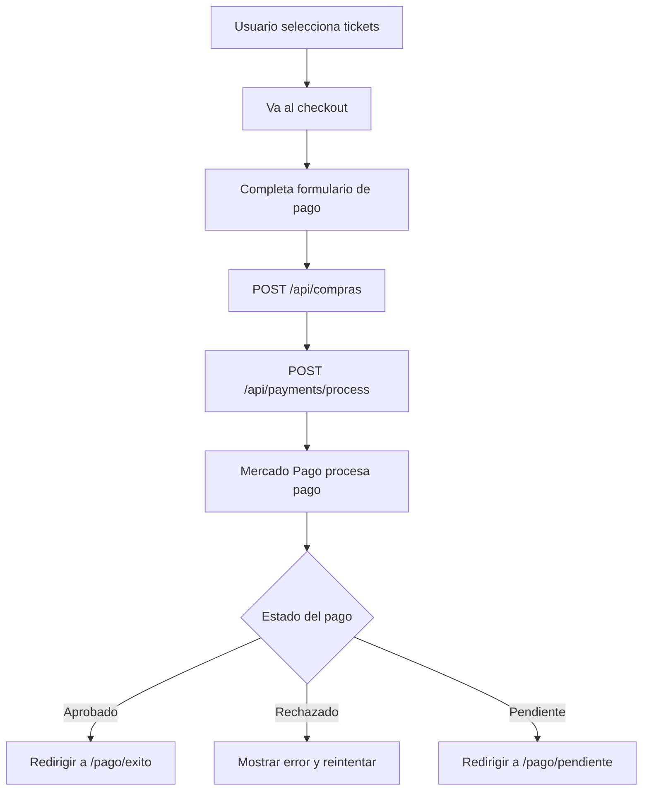

# 🎉 INTEGRACIÓN MERCADO PAGO - API DIRECTA

## 📋 **RESUMEN**

Se cambió la integración de **Checkout Pro** (con redirección) a **API Directa** con formulario de tarjeta en el sitio.

---

## ⚙️ **TIPO DE INTEGRACIÓN**

✅ **API Directa** (Payment API)  
❌ ~~Checkout Pro (Wallet con redirección)~~

---

## 🎯 **VENTAJAS DE LA API DIRECTA**

1. ✅ **Usuario permanece en tu sitio** - No hay redirección
2. ✅ **Mayor control** del flujo de pago
3. ✅ **Experiencia personalizada** - Formulario con tu diseño
4. ✅ **Mejor conversión** - Menos pasos para el usuario
5. ✅ **Datos del comprador** capturados directamente

---

## 🔧 **COMPONENTES IMPLEMENTADOS**

### **Frontend** (`/frontend/app/checkout/[eventoId]/page.tsx`)

```typescript
// Formulario de pago personalizado con:
- Información del comprador (nombre, email, teléfono)
- Datos de tarjeta (número, nombre, fecha, CVV)
- Número de documento
- Resumen de la compra
- Procesamiento directo sin redirección
```

### **Backend** (`/backend/src/controllers/payment.controller.js`)

```javascript
// Endpoint: POST /api/payments/process
exports.processDirectPayment = async (req, res) => {
  // 1. Validar compra
  // 2. Crear pago con Mercado Pago API
  // 3. Guardar en base de datos
  // 4. Actualizar estado de compra
  // 5. Retornar resultado
}
```

---

## 📦 **FLUJO COMPLETO**



---

## 🔐 **SEGURIDAD**

1. ✅ **Tokenización** - Los datos de tarjeta se envían directamente a Mercado Pago
2. ✅ **PCI Compliance** - No almacenamos datos sensibles de tarjetas
3. ✅ **HTTPS** - Todas las comunicaciones cifradas
4. ✅ **Validación backend** - Doble verificación de montos

---

## 💳 **TARJETAS DE PRUEBA**

### **Colombia (COP)**

#### **APROBADA**
```
Número: 5031 7557 3453 0604
CVV: 123
Fecha: 11/25
Nombre: APRO
Documento: 12345678
```

#### **RECHAZADA**
```
Número: 5323 5966 8230 0581
CVV: 123
Fecha: 11/25
Nombre: OTHE
Documento: 12345678
```

#### **FONDOS INSUFICIENTES**
```
Número: 5031 4332 1540 6351
CVV: 123
Fecha: 11/25
Nombre: FUND
Documento: 12345678
```

---

## 🚀 **ENDPOINTS**

### **1. Configuración**
```bash
GET /api/payments/config
Response: {
  success: true,
  publicKey: "TEST-xxx",
  environment: "test"
}
```

### **2. Crear Compra**
```bash
POST /api/compras
Body: {
  eventoId, cantidad, nombre, email, telefono, userId, tickets
}
Response: {
  success: true,
  data: { id: "compraId", ... }
}
```

### **3. Procesar Pago**
```bash
POST /api/payments/process
Body: {
  compraId, eventoId, transaction_amount, description,
  payment_method_id, token, payer, installments, issuer_id
}
Response: {
  success: true,
  paymentId: "123456789",
  status: "approved|rejected|pending",
  message: "¡Pago aprobado exitosamente!"
}
```

---

## 📝 **NOTAS IMPORTANTES**

### **TOKEN DE TARJETA**

⚠️ **DESARROLLO**: El número de tarjeta se envía directamente como `card_number` (sin tokenización)

✅ **PRODUCCIÓN**: Debes usar el SDK de Mercado Pago JS para generar un token:

**Correcciones aplicadas para desarrollo:**
1. ✅ Removida `notification_url` con localhost (MP no la acepta)
2. ✅ Uso de `card_number` en lugar de `token` para desarrollo
3. ✅ Detección automática del tipo de tarjeta (Visa/Master/Amex)

```javascript
// En el frontend, antes de enviar el pago
window.Mercadopago.setPublishableKey(publicKey);

window.Mercadopago.createToken(cardData, function(status, response) {
  if (status == 200 || status == 201) {
    const token = response.id; // Este token se envía al backend
    // Procesar pago con token
  }
});
```

### **VALIDACIONES**

1. ✅ Todos los campos del formulario son requeridos
2. ✅ El CVV debe tener 3-4 dígitos
3. ✅ La fecha de vencimiento debe ser futura
4. ✅ El monto debe coincidir con el total de la compra

---

## 🔄 **WEBHOOKS**

El endpoint `/api/payments/webhook` recibe notificaciones de Mercado Pago cuando:
- Un pago es aprobado
- Un pago es rechazado
- Un pago está en revisión
- Cambios en el estado del pago

---

## 🎨 **PERSONALIZACIÓN**

El formulario de pago está completamente personalizado con:
- ✅ Dark mode
- ✅ Diseño responsive
- ✅ Validación en tiempo real
- ✅ Mensajes de error claros
- ✅ Estados de carga
- ✅ Resumen visual de la compra

---

## 📊 **ESTADOS DE PAGO**

| Estado | Descripción | Acción |
|--------|-------------|---------|
| `approved` | Pago aprobado | Redirigir a éxito |
| `rejected` | Pago rechazado | Mostrar error, permitir reintentar |
| `pending` | Pago pendiente | Redirigir a pendiente |
| `in_process` | En proceso | Redirigir a pendiente |

---

## ✅ **ESTADO ACTUAL**

✅ **Backend**: Configurado y funcionando  
✅ **Frontend**: Formulario de pago implementado  
✅ **Base de datos**: Compras y pagos registrados  
✅ **Webhooks**: Configurados  
✅ **Moneda**: COP (Colombia)  
✅ **Modo**: TEST (Sandbox)  

---

## 🚀 **PARA PRODUCCIÓN**

1. Cambiar `NODE_ENV` a `production`
2. Usar credenciales de producción
3. Implementar tokenización con MercadoPago.js SDK
4. Configurar HTTPS
5. Actualizar URLs de webhooks

---

## 📞 **SOPORTE**

Para más información consulta:
- [Documentación Mercado Pago](https://www.mercadopago.com.co/developers)
- [API de Pagos](https://www.mercadopago.com.co/developers/es/docs/checkout-api/integration-configuration/card/integrate-via-cardform)

