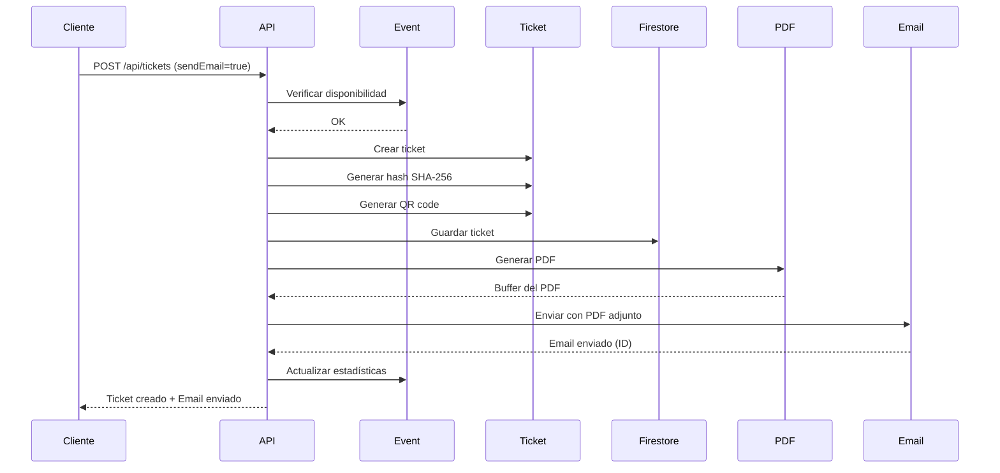
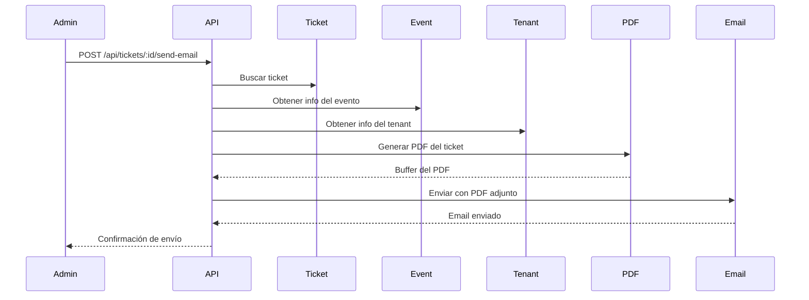

# ✅ US-031: Envío de Tickets por Email con PDF - COMPLETADO

**Fecha:** 1 de Noviembre, 2025  
**Estado:** ✅ Completado  
**Tiempo estimado:** 2-3 horas

---

## 📋 Resumen

Se implementó exitosamente el sistema de generación de PDF y envío automático de tickets por email, completando el flujo de entrega de tickets al comprador.

---

## 🎯 Objetivos Alcanzados

### 1. Servicio de Email (Resend)
✅ **Archivo:** `backend/src/utils/email.js` (290 líneas)

**Características implementadas:**
- Cliente de Resend configurado con API key
- Función genérica `sendEmail()` para envío de emails
- Función especializada `sendTicketEmail()` con template HTML
- Función `sendEventReminderEmail()` para recordatorios
- Manejo de attachments (PDF del ticket)
- Logging detallado de envíos
- Manejo robusto de errores

**Templates HTML incluidos:**
- ✅ Email de confirmación de compra con ticket
- ✅ Diseño responsive y moderno
- ✅ Información completa del evento
- ✅ Instrucciones de uso
- ✅ Branding del tenant personalizable
- ✅ Email de recordatorio de evento

---

### 2. Generación de PDF
✅ **Archivo:** `backend/src/utils/pdf.js` (250 líneas)

**Características del PDF:**
- ✅ Tamaño carta (LETTER)
- ✅ Header con nombre del tenant/comercio
- ✅ Número de ticket destacado
- ✅ Información del evento:
  - Nombre del evento (título grande)
  - Fecha y hora formateada
  - Ubicación/venue
  - Tipo de entrada (tier)
- ✅ Información del comprador:
  - Nombre completo
  - Email
- ✅ QR Code grande (200x200px)
  - Alta corrección de errores (H)
  - Centrado y visible
  - Instrucción "Escanea para validar"
- ✅ Caja de instrucciones destacada:
  - Fondo amarillo (#FFF3CD)
  - Borde naranja (#FFC107)
  - 4 instrucciones clave
- ✅ Footer con:
  - Fecha de emisión
  - Hash parcial (primeros 16 caracteres)
  - "Powered by Grada Negra"

**Formato del QR en PDF:**
```json
{
  "ticketNumber": "TKT-ABC123XYZ",
  "eventId": "evento123",
  "hash": "a3b5c7d9e1f2g3h4i5j6k7l8m9n0o1p2"
}
```

---

### 3. Integración Automática
✅ **Actualización:** `backend/src/controllers/ticket.controller.js`

**Funcionalidad agregada:**
- ✅ Envío automático al crear tickets (parámetro `sendEmail: true` por defecto)
- ✅ Generación de PDF por cada ticket
- ✅ Envío de email con PDF adjunto
- ✅ No falla la creación si falla el email (resiliente)
- ✅ Logging de resultados de email
- ✅ Reporta emails enviados en la respuesta

**Nuevo endpoint:**
- ✅ `POST /api/tickets/:id/send-email` - Reenvío manual de ticket

---

## 📊 Archivos Creados/Modificados

### Archivos Nuevos
- ✅ `backend/src/utils/email.js` (290 líneas)
- ✅ `backend/src/utils/pdf.js` (250 líneas)

### Archivos Modificados
- ✅ `backend/src/controllers/ticket.controller.js` (+140 líneas)
  - Función `createTickets()` actualizada con envío automático
  - Nueva función `sendTicketByEmail()` para reenvío
- ✅ `backend/src/routes/ticket.routes.js` (+8 líneas)
  - Nueva ruta `POST /:id/send-email`
  - Schema actualizado con campo `sendEmail`
- ✅ `backend/.env.example`
  - Ya incluía `RESEND_API_KEY`

---

## 🔄 Flujo Completo Implementado

### Creación de Tickets con Envío Automático



### Reenvío Manual de Ticket



---

## 📧 Template de Email

### Características del Template HTML
- ✅ **Responsive:** Se adapta a móviles y desktop
- ✅ **Profesional:** Diseño limpio con tipografía moderna
- ✅ **Personalizable:** Usa nombre del tenant y colores
- ✅ **Información clara:**
  - Saludo personalizado con nombre del comprador
  - Título del evento destacado
  - Fecha y hora formateada en español
  - Ubicación del evento
  - Tipo de entrada (tier)
  - Número de ticket destacado en negro
- ✅ **Instrucciones importantes:**
  - Caja amarilla con advertencias
  - 4 puntos clave de uso
- ✅ **CTA claro:** "Tu ticket PDF está adjunto a este email"
- ✅ **Footer:** Info del organizador + Powered by Grada Negra

### Vista previa del email (texto):
```
🎫 [Nombre del Tenant]
Tu ticket está listo

Hola [Nombre del Comprador],

¡Gracias por tu compra! Tu ticket para el evento ha sido confirmado.

[Nombre del Evento]

📅 Fecha y Hora
[Fecha formateada]

📍 Ubicación
[Venue del evento]

🎟️ Tipo de Entrada
[Nombre del tier]

Ticket #TKT-ABC123XYZ

⚠️ Importante:
• Presenta este ticket (PDF adjunto) en la entrada del evento
• El código QR será escaneado para validar tu entrada
• Guarda este email o descarga el PDF adjunto
• No compartas tu ticket con nadie para evitar uso no autorizado

Tu ticket PDF está adjunto a este email
Descárgalo y preséntalo en tu dispositivo móvil o impreso
```

---

## 🔒 Configuración de Resend

### Variables de Entorno Requeridas

```bash
# En .env
RESEND_API_KEY=re_tu_api_key_aqui
```

### Obtener API Key de Resend

1. Crear cuenta en https://resend.com
2. Verificar dominio (o usar dominio de prueba)
3. Ir a "API Keys" en el dashboard
4. Crear nueva API key
5. Copiar y pegar en `.env`

### Límites del Free Tier de Resend
- ✅ 100 emails/día
- ✅ 3,000 emails/mes
- ✅ Perfecto para desarrollo y MVP
- ✅ Sin costo ($0/mes)

---

## 📝 Ejemplos de Uso

### 1. Crear Tickets con Envío Automático

```bash
curl -X POST http://localhost:8080/api/tickets \
  -H "Authorization: Bearer <token>" \
  -H "Content-Type: application/json" \
  -d '{
    "eventId": "evento123",
    "tierId": "tier-uuid",
    "quantity": 2,
    "sendEmail": true,
    "buyer": {
      "name": "María García",
      "email": "maria@example.com",
      "phone": "+52 55 1234 5678"
    }
  }'
```

**Response:**
```json
{
  "success": true,
  "data": {
    "tickets": [...],
    "created": 2,
    "emailsSent": 2,
    "emailResults": [
      {
        "ticketId": "ticket1",
        "ticketNumber": "TKT-ABC123",
        "emailId": "re_abc123xyz",
        "sentTo": "maria@example.com"
      }
    ]
  },
  "message": "2 ticket(s) creado(s) y 2 email(s) enviado(s)"
}
```

### 2. Crear Tickets SIN Envío Automático

```bash
curl -X POST http://localhost:8080/api/tickets \
  -H "Authorization: Bearer <token>" \
  -H "Content-Type: application/json" \
  -d '{
    "eventId": "evento123",
    "tierId": "tier-uuid",
    "quantity": 1,
    "sendEmail": false,
    "buyer": {
      "name": "Juan Pérez",
      "email": "juan@example.com"
    }
  }'
```

### 3. Reenviar Ticket por Email

```bash
curl -X POST http://localhost:8080/api/tickets/ticket123/send-email \
  -H "Authorization: Bearer <token>"
```

**Response:**
```json
{
  "success": true,
  "message": "Ticket enviado por email exitosamente",
  "data": {
    "emailId": "re_abc123xyz",
    "sentTo": "maria@example.com"
  }
}
```

---

## 🧪 Testing

### Script de Pruebas Manual

```bash
# 1. Crear ticket con envío automático
curl -X POST http://localhost:8080/api/tickets \
  -H "Authorization: Bearer $TOKEN" \
  -H "Content-Type: application/json" \
  -d '{
    "eventId": "'$EVENT_ID'",
    "tierId": "'$TIER_ID'",
    "quantity": 1,
    "sendEmail": true,
    "buyer": {
      "name": "Test User",
      "email": "tu-email@example.com",
      "phone": "+52 55 1234 5678"
    }
  }'

# 2. Verificar en tu email:
#    - Recibiste el email
#    - El PDF está adjunto
#    - El QR se ve correctamente
#    - La información es correcta

# 3. Probar reenvío
TICKET_ID="<id-del-ticket-creado>"
curl -X POST http://localhost:8080/api/tickets/$TICKET_ID/send-email \
  -H "Authorization: Bearer $TOKEN"
```

---

## ✅ Funcionalidades Implementadas

### Generación de PDF ✅
- [x] PDF tamaño carta
- [x] Header con nombre del tenant
- [x] Información completa del evento
- [x] QR Code integrado (200x200px)
- [x] Información del comprador
- [x] Instrucciones de uso
- [x] Hash de seguridad en footer
- [x] Diseño profesional

### Envío de Email ✅
- [x] Integración con Resend
- [x] Template HTML responsive
- [x] PDF adjunto automáticamente
- [x] Personalización por tenant
- [x] Manejo de errores
- [x] Logging detallado
- [x] Email de confirmación
- [x] Email de recordatorio (template listo)

### Endpoints ✅
- [x] POST /api/tickets (con sendEmail opcional)
- [x] POST /api/tickets/:id/send-email (reenvío)
- [x] Validación de permisos
- [x] Respuesta con info de emails enviados

---

## 🚀 Mejoras Futuras (Fuera de Scope)

### Funcionalidades Adicionales
- 🔜 **Apple Wallet (.pkpass)** - US-034
  - Generar archivos .pkpass
  - Adjuntar al email
  - Update notifications
  
- 🔜 **Recordatorios Automáticos**
  - Envío 24h antes del evento
  - Envío 2h antes del evento
  - Cloud Scheduler + Cloud Functions

- 🔜 **Templates Personalizables**
  - Editor visual de templates
  - Variables dinámicas
  - Múltiples idiomas

- 🔜 **Analytics de Emails**
  - Tasa de apertura
  - Tasa de clicks
  - Bounces y errores

- 🔜 **Múltiples Idiomas**
  - Español (actual)
  - Inglés
  - Detección automática por locale

---

## 📈 Impacto en el MVP

**Antes de US-031:** 80% (8/10 core stories)  
**Después de US-031:** 90% (9/10 core stories) 🎉

**Stories completadas:**
1. ✅ US-006: Autenticación
2. ✅ US-001: Crear Tenants
3. ✅ US-002: Asignar Admins
4. ✅ US-003: Listar Tenants
5. ✅ US-007: Dashboard
6. ✅ US-008: Gestión de usuarios
7. ✅ US-012: Crear Eventos
8. ✅ US-013: Configurar Tiers
9. ✅ US-014: Generar Tickets con QR
10. ✅ US-031: Envío de Tickets por Email ⬅️ **COMPLETADA**

**Pendiente para MVP 100%:**
- 🔜 US-025: Integración de pagos (requiere contrato comercial)

---

## 📚 Documentación Técnica

### Utilidades Creadas

#### `email.js`
```javascript
// Funciones exportadas:
sendEmail({ to, subject, html, attachments, from })
sendTicketEmail({ to, buyerName, event, ticket, tenantName, pdfBuffer })
sendEventReminderEmail({ to, buyerName, event, ticketNumber })
```

#### `pdf.js`
```javascript
// Funciones exportadas:
generateTicketPDF({ ticket, event, tenant, tierName })
generateMultipleTicketPDFs(tickets) // Array de tickets
```

---

## 🎉 Conclusión

La **US-031 está 100% completada** con todas las funcionalidades requeridas:
- ✅ Servicio de email configurado (Resend)
- ✅ Generación de PDF profesional
- ✅ Template HTML responsive
- ✅ Envío automático post-creación
- ✅ Endpoint de reenvío manual
- ✅ Manejo robusto de errores
- ✅ Logging completo

**El flujo completo de ticketing está operativo:**
1. Crear evento con tiers ✅
2. Generar tickets con QR y hash ✅
3. Enviar ticket por email con PDF ✅
4. Validar en entrada (check-in) ✅

**Solo falta integración de pagos para completar el MVP al 100%.**

---

**Desarrollado por:** GitHub Copilot  
**Tecnologías:** Resend, PDFKit, QRCode, Node.js  
**Dependencias:** resend@3.5.0, pdfkit@0.14.0, qrcode@1.5.4  
**Total de líneas nuevas:** ~700 líneas de código
