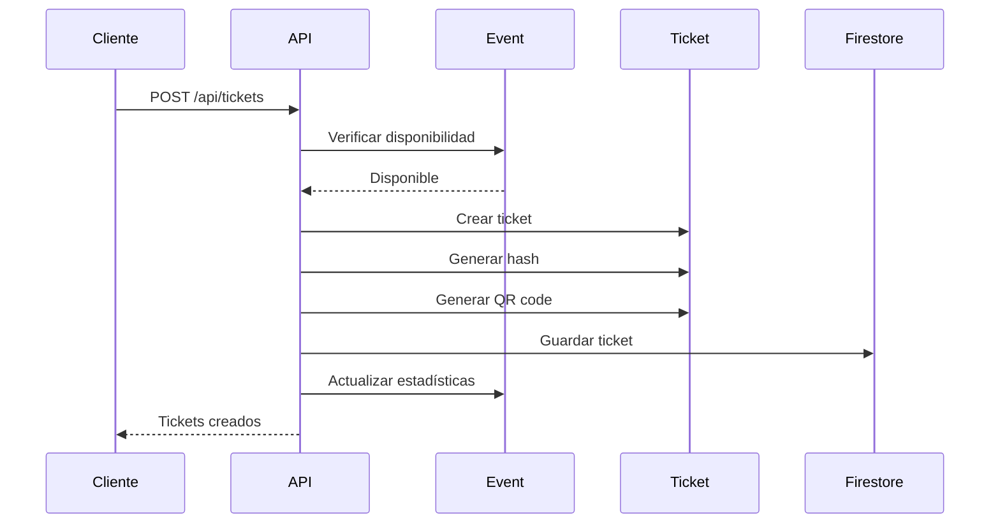
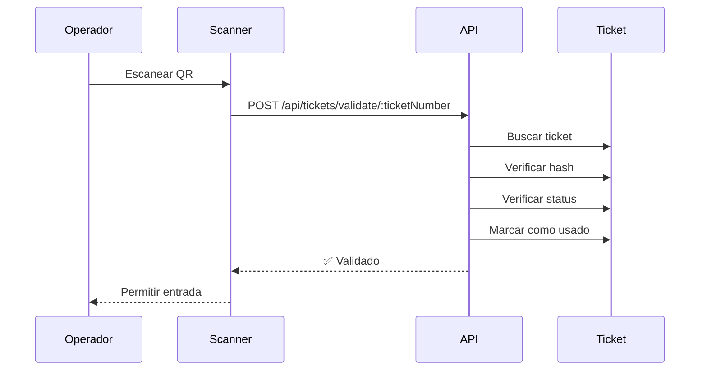

# API de Tickets - Grada Negra

## Descripción General

Esta API maneja la generación, gestión y validación de tickets para eventos en la plataforma Grada Negra. Cada ticket tiene un QR code único y un hash de seguridad SHA-256 para prevenir falsificaciones.

---

## Autenticación

Todos los endpoints requieren autenticación mediante Firebase Auth token en el header:

```
Authorization: Bearer <firebase_token>
```

---

## Endpoints

### 1. Crear Tickets

**POST** `/api/tickets`

Crea uno o más tickets para un evento.

**Permisos requeridos:** `manage_tickets`

**Request Body:**
```json
{
  "eventId": "evento123",
  "tierId": "tier-uuid",
  "quantity": 2,
  "purchaseId": "order-abc123",
  "buyer": {
    "name": "Juan Pérez",
    "email": "juan@example.com",
    "phone": "+52 55 1234 5678",
    "documentId": "CURP12345678"
  }
}
```

**Response 201:**
```json
{
  "success": true,
  "data": {
    "tickets": [
      {
        "id": "ticket1",
        "ticketNumber": "TKT-ABC123XYZ",
        "eventId": "evento123",
        "tenantId": "tenant1",
        "tierId": "tier-uuid",
        "purchaseId": "order-abc123",
        "buyer": {
          "name": "Juan Pérez",
          "email": "juan@example.com",
          "phone": "+52 55 1234 5678",
          "documentId": "CURP12345678"
        },
        "securityHash": "a3b5c7d9e1f2g3h4i5j6k7l8m9n0o1p2",
        "qrCodeDataUrl": "data:image/png;base64,iVBORw0KGgoAAAANSUhEUg...",
        "price": 500,
        "currency": "MXN",
        "fees": 0,
        "taxes": 0,
        "total": 500,
        "status": "confirmed",
        "isValidated": false,
        "validatedAt": null,
        "isTransferable": false,
        "metadata": {
          "seat": null,
          "zone": null,
          "notes": ""
        },
        "createdAt": "2025-11-01T17:30:00Z",
        "updatedAt": "2025-11-01T17:30:00Z"
      }
    ],
    "created": 2,
    "errors": []
  }
}
```

**Errores:**
- `404`: Evento no encontrado
- `404`: Tier no encontrado
- `400`: Evento no disponible para venta
- `400`: No hay suficientes tickets disponibles
- `403`: No tienes permiso para crear tickets en este evento

---

### 2. Obtener Ticket por ID

**GET** `/api/tickets/:id`

Obtiene los detalles de un ticket específico.

**Permisos requeridos:** `manage_tickets`

**Response 200:**
```json
{
  "success": true,
  "data": {
    "id": "ticket1",
    "ticketNumber": "TKT-ABC123XYZ",
    "eventId": "evento123",
    "tenantId": "tenant1",
    "tierId": "tier-uuid",
    "buyer": {
      "name": "Juan Pérez",
      "email": "juan@example.com"
    },
    "securityHash": "a3b5c7d9e1f2g3h4i5j6k7l8m9n0o1p2",
    "qrCodeDataUrl": "data:image/png;base64,...",
    "price": 500,
    "currency": "MXN",
    "total": 500,
    "status": "confirmed",
    "isValidated": false,
    "createdAt": "2025-11-01T17:30:00Z"
  }
}
```

**Errores:**
- `404`: Ticket no encontrado
- `403`: No tienes permiso para ver este ticket

---

### 3. Obtener Ticket por Número

**GET** `/api/tickets/number/:ticketNumber`

Obtiene un ticket usando su número único.

**Response 200:**
```json
{
  "success": true,
  "data": {
    "id": "ticket1",
    "ticketNumber": "TKT-ABC123XYZ",
    "eventId": "evento123",
    "status": "confirmed",
    "isValidated": false
  }
}
```

**Errores:**
- `404`: Ticket no encontrado
- `403`: No tienes permiso para ver este ticket

---

### 4. Listar Tickets de un Evento

**GET** `/api/events/:eventId/tickets`

Lista todos los tickets de un evento con filtros opcionales.

**Permisos requeridos:** `manage_tickets`

**Query Parameters:**
- `status` (opcional): `pending`, `confirmed`, `cancelled`, `used`
- `tierId` (opcional): Filtrar por tier específico
- `isValidated` (opcional): `true` o `false`
- `limit` (opcional): Máximo de resultados (default: 100)

**Ejemplo:** `/api/events/evento123/tickets?status=confirmed&limit=50`

**Response 200:**
```json
{
  "success": true,
  "data": {
    "tickets": [
      {
        "id": "ticket1",
        "ticketNumber": "TKT-ABC123XYZ",
        "tierId": "tier-uuid",
        "buyer": {
          "name": "Juan Pérez",
          "email": "juan@example.com"
        },
        "status": "confirmed",
        "isValidated": false,
        "price": 500,
        "createdAt": "2025-11-01T17:30:00Z"
      }
    ],
    "count": 1
  }
}
```

**Errores:**
- `404`: Evento no encontrado
- `403`: No tienes permiso para ver tickets de este evento

---

### 5. Listar Tickets de un Comprador

**GET** `/api/tickets/buyer/:email`

Lista todos los tickets de un comprador específico.

**Nota:** Solo puedes ver tus propios tickets a menos que tengas el permiso `manage_tickets`.

**Response 200:**
```json
{
  "success": true,
  "data": {
    "tickets": [
      {
        "ticketNumber": "TKT-ABC123XYZ",
        "eventId": "evento123",
        "tierId": "tier-uuid",
        "buyer": {
          "name": "Juan Pérez",
          "email": "juan@example.com"
        },
        "price": 500,
        "currency": "MXN",
        "total": 500,
        "status": "confirmed",
        "isValidated": false,
        "createdAt": "2025-11-01T17:30:00Z"
      }
    ],
    "count": 1
  }
}
```

**Errores:**
- `403`: No tienes permiso para ver estos tickets

---

### 6. Validar Ticket (Check-in)

**POST** `/api/tickets/:id/validate`

Valida un ticket en el punto de entrada del evento (check-in).

**Permisos requeridos:** `validate_tickets`

**Response 200:**
```json
{
  "success": true,
  "data": {
    "id": "ticket1",
    "ticketNumber": "TKT-ABC123XYZ",
    "status": "used",
    "isValidated": true,
    "validatedAt": "2025-11-01T19:00:00Z",
    "validatedBy": "user-uid-123"
  },
  "message": "Ticket validado exitosamente"
}
```

**Errores:**
- `404`: Ticket no encontrado
- `403`: No tienes permiso para validar este ticket
- `400`: Hash de seguridad inválido
- `400`: Este ticket ya ha sido validado
- `400`: Este ticket ha sido cancelado
- `400`: Este ticket no está confirmado

---

### 7. Validar Ticket por Número

**POST** `/api/tickets/validate/:ticketNumber`

Valida un ticket usando su número único (útil para entrada manual).

**Permisos requeridos:** `validate_tickets`

**Response 200:**
```json
{
  "success": true,
  "data": {
    "ticketNumber": "TKT-ABC123XYZ",
    "status": "used",
    "isValidated": true,
    "validatedAt": "2025-11-01T19:00:00Z"
  },
  "message": "Ticket validado exitosamente"
}
```

**Errores:** Mismos que el endpoint anterior.

---

### 8. Cancelar Ticket

**DELETE** `/api/tickets/:id`

Cancela un ticket (no puede ser un ticket ya validado).

**Permisos requeridos:** `manage_tickets`

**Response 200:**
```json
{
  "success": true,
  "message": "Ticket cancelado exitosamente"
}
```

**Errores:**
- `404`: Ticket no encontrado
- `403`: No tienes permiso para cancelar este ticket
- `400`: No se puede cancelar un ticket ya validado

---

### 9. Regenerar QR Code

**POST** `/api/tickets/:id/regenerate-qr`

Regenera el QR code de un ticket (útil si el QR se dañó o perdió).

**Permisos requeridos:** `manage_tickets`

**Response 200:**
```json
{
  "success": true,
  "data": {
    "qrCodeDataUrl": "data:image/png;base64,iVBORw0KGgoAAAANSUhEUg..."
  },
  "message": "QR code regenerado exitosamente"
}
```

**Errores:**
- `404`: Ticket no encontrado
- `403`: No tienes permiso para regenerar el QR de este ticket

---

## Modelo de Datos

### Ticket

```typescript
{
  id: string;
  ticketNumber: string;           // Formato: TKT-TIMESTAMP-RANDOM
  eventId: string;
  tenantId: string;
  tierId: string;                 // UUID del tier
  purchaseId: string | null;      // ID de la orden/compra
  
  buyer: {
    name: string;
    email: string;
    phone: string;
    documentId: string;           // DNI, RFC, CURP, etc.
  };
  
  securityHash: string;           // SHA-256 hash
  qrCodeDataUrl: string;          // Base64 data URL del QR
  pdfUrl: string | null;          // URL en Cloud Storage
  
  price: number;
  currency: string;               // MXN, USD, etc.
  fees: number;
  taxes: number;
  total: number;
  
  status: 'pending' | 'confirmed' | 'cancelled' | 'used';
  
  isValidated: boolean;
  validatedAt: string | null;
  validatedBy: string | null;     // User ID que validó
  
  isTransferable: boolean;
  transferredTo: string | null;
  transferredAt: string | null;
  
  metadata: {
    seat: string | null;
    zone: string | null;
    notes: string;
  };
  
  createdAt: string;
  updatedAt: string;
  expiresAt: string | null;
}
```

---

## Flujo de Uso

### 1. Compra de Tickets



### 2. Validación en Entrada



---

## Seguridad

### Hash de Seguridad

El hash se genera usando SHA-256 sobre:
```json
{
  "ticketNumber": "TKT-ABC123XYZ",
  "eventId": "evento123",
  "tierId": "tier-uuid",
  "buyerEmail": "juan@example.com",
  "createdAt": "2025-11-01T17:30:00Z"
}
```

### QR Code

El QR contiene:
```json
{
  "ticketNumber": "TKT-ABC123XYZ",
  "eventId": "evento123",
  "hash": "a3b5c7d9e1f2g3h4i5j6k7l8m9n0o1p2"
}
```

### Prevención de Duplicados

- El sistema verifica `isValidated` antes de permitir check-in
- Una vez validado, `validatedAt` y `validatedBy` se registran
- No se puede validar dos veces el mismo ticket

---

## Permisos Requeridos

| Endpoint | Permiso |
|----------|---------|
| POST /api/tickets | `manage_tickets` |
| GET /api/tickets/:id | `manage_tickets` |
| GET /api/tickets/number/:ticketNumber | Ninguno (propio ticket) |
| GET /api/events/:eventId/tickets | `manage_tickets` |
| GET /api/tickets/buyer/:email | Ninguno (propio email) |
| POST /api/tickets/:id/validate | `validate_tickets` |
| POST /api/tickets/validate/:ticketNumber | `validate_tickets` |
| DELETE /api/tickets/:id | `manage_tickets` |
| POST /api/tickets/:id/regenerate-qr | `manage_tickets` |

---

## Ejemplos de Uso

### Crear un Ticket

```bash
curl -X POST http://localhost:8080/api/tickets \
  -H "Authorization: Bearer <firebase_token>" \
  -H "Content-Type: application/json" \
  -d '{
    "eventId": "evento123",
    "tierId": "tier-uuid-1",
    "quantity": 1,
    "buyer": {
      "name": "María López",
      "email": "maria@example.com",
      "phone": "+52 55 9876 5432"
    }
  }'
```

### Validar un Ticket

```bash
curl -X POST http://localhost:8080/api/tickets/validate/TKT-ABC123XYZ \
  -H "Authorization: Bearer <firebase_token>"
```

### Listar Tickets de un Evento

```bash
curl -X GET "http://localhost:8080/api/events/evento123/tickets?status=confirmed" \
  -H "Authorization: Bearer <firebase_token>"
```

---

## Notas Técnicas

- Los tickets se almacenan en la colección `tickets` de Firestore
- Los QR codes se generan con la librería `qrcode` (nivel de corrección H)
- Los hashes usan SHA-256 con la utilidad `crypto.js`
- Los números de ticket son únicos y se generan con timestamp + random
- La validación de disponibilidad se hace a nivel de tier antes de crear tickets
- Las estadísticas del evento se actualizan automáticamente al crear/cancelar tickets

---

## Próximas Funcionalidades

- **Generación de PDF**: Crear archivos PDF con el ticket
- **Envío de Email**: Enviar ticket automáticamente al comprador
- **Apple Wallet**: Generar archivos `.pkpass`
- **Transferencia**: Permitir transferir tickets entre usuarios
- **Reembolsos**: Sistema de cancelación con reembolso
